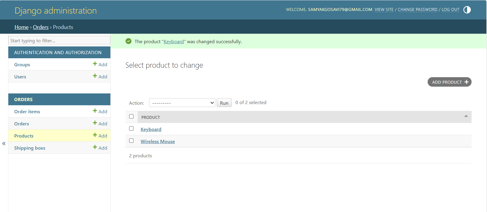

# Shipping Box Recommendation System

A Django-based application that recommends the most suitable shipping box for an order based on product dimensions, total volume, weight capacity, box availability, and cost.

## Features

- Create orders using products from the product catalogue
- Specify quantities for multiple products
- Calculate total order weight automatically
- Calculate total order volume automatically
- Validate individual product dimensions against shipping boxes
- Support product rotation when checking dimensions
- Filter inactive shipping boxes
- Reject boxes with insufficient weight capacity
- Reject boxes with insufficient volume
- Select the cheapest valid shipping box
- Use the smallest box as a tie-breaker when costs are equal
- Display order summary and recommended box
- Manage products and shipping boxes through Django Admin
- Automated tests for recommendation logic, forms, and views
- Responsive Django template UI

## Technology Stack

- Python
- Django
- SQLite
- HTML
- CSS
- Django Templates
- Django Test Framework

## Screenshots

### Create Order


### Box Recommendation


### Django Admin



## Project Structure

```text
box-recommender/
│
├── config/
│   ├── settings.py
│   ├── urls.py
│   ├── asgi.py
│   └── wsgi.py
│
├── orders/
│   ├── migrations/
│   │
│   ├── services/
│   │   └── box_recommender.py
│   │
│   ├── static/
│   │   └── orders/
│   │       └── css/
│   │           └── style.css
│   │
│   ├── templates/
│   │   └── orders/
│   │       ├── base.html
│   │       ├── order_create.html
│   │       └── order_detail.html
│   │
│   ├── admin.py
│   ├── forms.py
│   ├── models.py
│   ├── tests.py
│   ├── urls.py
│   └── views.py
│
├── screenshots/
│   ├── create-order.png
│   ├── recommendation.png
│   └── admin.png
│
├── AI_USAGE.md
├── CHAT_TRANSCRIPT.md
├── TEST_OUTPUT.md
├── manage.py
├── requirements.txt
├── README.md
└── .gitignore
```

## Box Recommendation Logic

For each order, the system:

1. Calculates the total weight of all products.
2. Calculates the total product volume.
3. Checks whether each product can fit inside the box.
4. Checks whether the total order weight is within the box's maximum weight capacity.
5. Checks whether the total order volume is within the box volume.
6. Ignores inactive shipping boxes.
7. Selects the cheapest valid shipping box.
8. If multiple valid boxes have the same cost, selects the smaller box by volume.

Product rotation is supported by sorting the product dimensions and box dimensions before comparing them.

## Assumptions and Limitations

The system uses total product volume as a practical approximation when checking whether multiple products can fit inside a box.

It also checks each product individually against the box dimensions with rotation allowed.

This does not implement an exact 3D bin-packing algorithm. Therefore, in some complex arrangements, products may satisfy the individual dimension and total volume checks while still not being physically packable in the exact real-world arrangement.

## Installation

### 1. Clone the repository

```bash
git clone <repository-url>
cd shipping-box-recommender
```

### 2. Create a virtual environment

Windows:

```bash
python -m venv venv
venv\Scripts\activate
```

macOS/Linux:

```bash
python3 -m venv venv
source venv/bin/activate
```

### 3. Install dependencies

```bash
pip install -r requirements.txt
```

### 4. Apply migrations

```bash
python manage.py migrate
```

### 5. Create an administrator account

```bash
python manage.py createsuperuser
```

### 6. Start the development server

```bash
python manage.py runserver
```

Open the application at:

```text
http://127.0.0.1:8000/orders/create/
```

Django Admin is available at:

```text
http://127.0.0.1:8000/admin/
```

## Initial Setup

After creating an administrator account:

1. Open Django Admin.
2. Add products with their dimensions and weight.
3. Add shipping boxes with internal dimensions, maximum weight, cost, and active status.
4. Open the Create Order page.
5. Select product quantities.
6. Submit the order to receive a shipping-box recommendation.

Products and shipping boxes are managed through Django Admin, while the main application focuses on order creation and automatic box recommendation.

## Running Tests

Run all automated tests with:

```bash
python manage.py test
```

For detailed test output:

```bash
python manage.py test --verbosity=2
```

The project currently contains 31 automated tests covering:

- Product and box volume calculations
- Order weight and volume calculations
- Product dimension validation
- Product rotation
- Weight and volume restrictions
- Inactive shipping boxes
- Cheapest valid box selection
- Equal-cost tie-breaking
- No valid box cases
- Order form validation
- Order creation
- Order item quantities
- Redirect behaviour
- Order detail views
- Recommendation display
- 404 handling

The complete test run output is also included in `TEST_OUTPUT.md`.

## Design Decisions

### Django Admin for Catalogue Management

Products and shipping boxes are managed through Django Admin instead of separate CRUD pages.

This keeps the main application focused on its primary purpose: creating orders and recommending suitable shipping boxes.

### Service Layer

The recommendation logic is kept separately in:

```text
orders/services/box_recommender.py
```

This separates the business logic from Django views and makes the recommendation engine easier to test.

### Decimal Values

Django `DecimalField` is used for dimensions, weights, and costs to avoid unnecessary floating-point precision issues.

## Possible Future Improvements

- Exact 3D bin-packing algorithm
- Product and shipping-box management UI
- Box inventory tracking
- Shipping cost calculation
- Authentication and user roles
- REST API
- PostgreSQL support
- Docker deployment

## AI Usage

AI usage during development is documented in:

```text
AI_USAGE.md
```

The development chat reference/transcript information is included in:

```text
CHAT_TRANSCRIPT.md
```

## Author

Samyak Gosavi